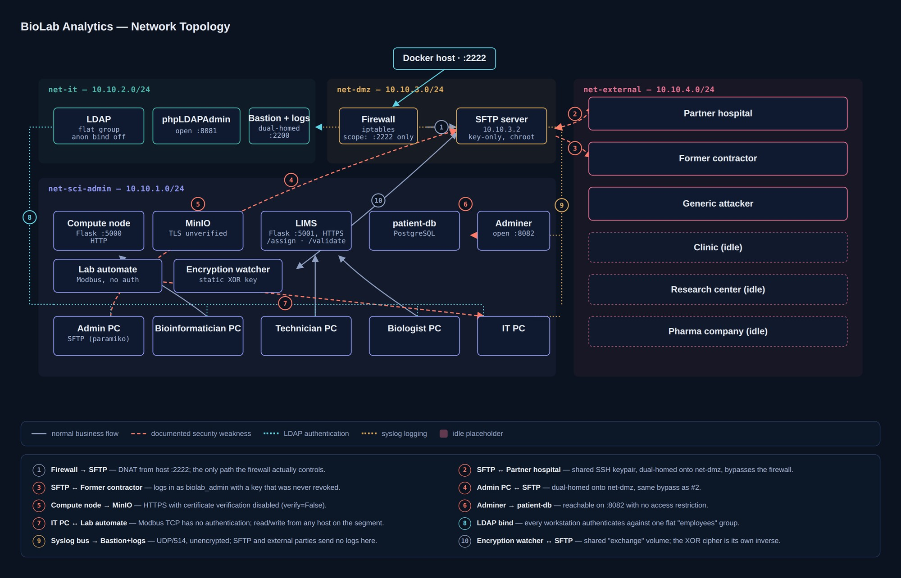

# BioLab Analytics — Vulnerable Infrastructure Mockup

> A deliberately vulnerable, fully functional Terraform/Docker mockup of a biomedical
> genomics laboratory, built to support an **EBIOS Risk Manager** risk analysis.

---

## ⚠️ Disclaimer

This environment is **intentionally insecure** (weak passwords, shared SSH keys, homemade
XOR "encryption", no authentication on Modbus, flat network, etc.). It exists for
**educational and risk-analysis purposes only**.

- Run it **only** on an isolated local machine or a dedicated lab network.
- **Never** expose it to the Internet or reuse any credential or key from it.
- All data is synthetic. No real patient or genetic data is involved.

---

## 1. Overview

**BioLab Analytics** is a fictional biomedical laboratory specialised in
genetic sequencing and advanced biological testing. It works for hospitals, private clinics,
research centres and pharmaceutical companies, and handles highly sensitive data: DNA
sequences, medical results and patient identities.

The mockup reproduces the laboratory's information system , including its security problems:

|---|---|
| Homemade encryption in an internal tool | Watcher container using a **static, hardcoded XOR key** (no IV, no salt) — encryption = decryption |
| SFTP keys not renewed for years | Same SSH keypair shared by `biolab_admin` and the partner hospital, never rotated; a **former contractor's key** was never revoked |
| Biomedical servers in the same VLAN as admin workstations | Compute node, LIMS, DB, lab automate and all workstations on a **single flat network** |
| No internal PKI, self-signed certificates | Self-signed internal CA, TLS verification **disabled** on the compute node → MinIO flow |

The whole business workflow (hospital intake → analysis → assignment → medical validation →
encryption → delivery → closure) is **executable end to end** using real SFTP / HTTP / DB calls.

---

## 2. Architecture

Four Docker networks are deployed:

| Network | CIDR | Contents |
|---|---|---|
| `net-sci-admin` | `10.10.1.0/24` | Compute node, MinIO, LIMS, patient-db, lab automate, encryption watcher, 5 user workstations, Adminer |
| `net-it` | `10.10.2.0/24` | LDAP, phpLDAPAdmin, bastion + log server (`10.10.2.10`) |
| `net-dmz` | `10.10.3.0/24` | SFTP server (`10.10.3.2`), firewall |
| `net-external` | `10.10.4.0/24` | Partner hospital, former contractor, generic attacker, idle clinic / research centre / pharma placeholders |

## 3. Business workflow

1. **Intake** — the hospital drops the genetic file into the SFTP `inbound/` folder.
2. **Administrative registration** — admin workstation creates the patient / record, generates a
   **barcode** and a pending invoice.
3. **Transmission** — file retrieved via SFTP, labelled by barcode only (never identity), and
   placed in the shared `handoff` volume.
4. **Analysis** — the bioinformatician submits it to the compute node; the result is pushed to MinIO.
5. **Assignment** — the technician scans the barcode in the LIMS.
6. **Medical validation** — the biologist validates through the LIMS.
7. **Delivery preparation** — the admin fetches the validated result and uploads it to `to_encrypt/`.
8. **Homemade encryption** — the watcher encrypts it automatically into `outbound/`.
9. **Delivery** — the hospital retrieves the encrypted file via SFTP.
10. **Closure** — the admin checks the delivery; status → `delivered`, invoice → `sent`.

Record status lifecycle: `received → in_analysis → assigned → validated → encrypted → delivered`.

---

## 4. Getting started

### Access points (from the Docker host)

> Credentials, keys and the full end-to-end walkthrough (`docker exec` commands + LIMS web UI)
> are documented in `OPERATIONS_MANUAL.md`. Secrets, keys and `*.tfvars` are excluded from
> version control through `.gitignore`.

---

## 5. Troubleshooting

Errors met during deployment and their fixes are recorded in [`common_errors.md`](common_errors.md).

---

## 6. Risk analysis (EBIOS Risk Manager)

The mockup supports a full risk analysis following the **EBIOS RM** method (ANSSI, 2018),
delivered as a separate LaTeX report (in French). It covers:

- **Workshop 1** — security baseline, business values, feared events
- **Workshop 2** — risk sources and targeted objectives
- **Workshop 3** — strategic scenarios (stakeholder ecosystem)
- **Workshop 4** — operational scenarios (Know → Enter → Find → Exploit)
- **Workshop 5** — risk treatment plan (MoSCoW), initial and residual risk matrices

---

## Authors

**Malek Kahia**

